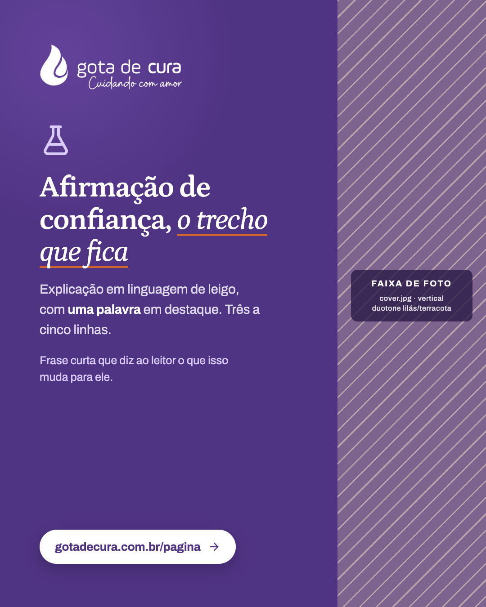
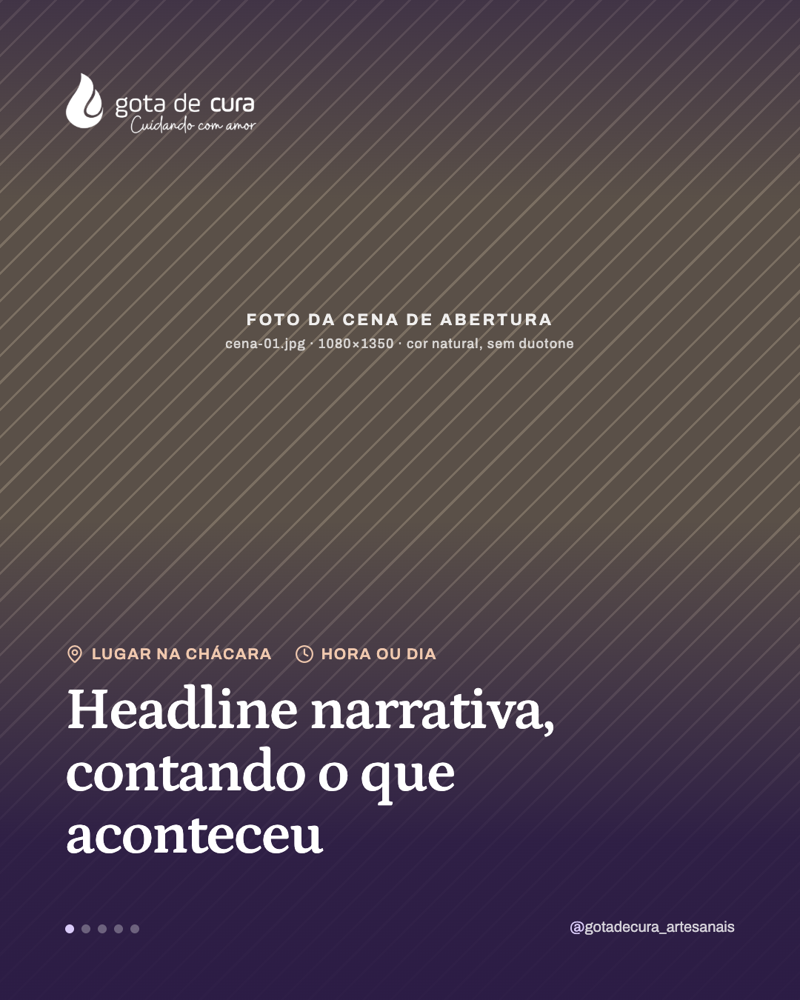
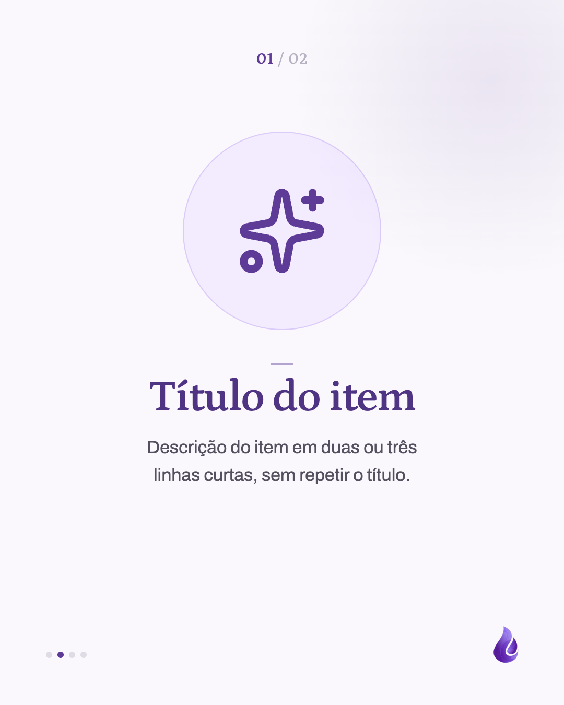

# Templates de post — @gotadecura_artesanais

Esqueletos visuais recorrentes. Ficam entre o `BRAND.md` (paleta, voz, fontes, assinatura:
vale para tudo) e o post concreto (conteúdo e ângulo). A skill `/instagram-post` lê este
índice e **pergunta qual template seguir** antes de desenhar.

```
BRAND.md  →  template escolhido  →  pedido do post
(paleta, voz,   (capa, sequência,     (conteúdo, ângulo,
 assinatura)     papel da imagem)      ajustes pontuais)
```

Cada template tem um `.md` nesta pasta e previews em `previews/<id>/`.

---

## Catálogo

| ID | Nome | Formato | Imagem | Quando usar |
|---|---|---|---|---|
| [`carrossel-educativo`](carrossel-educativo.md) | Carrossel educativo | Carrossel 5–7 | Capa: exige foto | Explicar um conceito em partes (adaptação de post do blog, dúvida frequente). |
| [`lista-ilustrada`](lista-ilustrada.md) | Lista ilustrada | Carrossel 5–7 | Capa: exige foto; itens: ícone Lucide | Uma lista de 3 a 5 itens do mesmo tipo (valores, cuidados, motivos), um por slide, cada um com ícone grande, título e descrição. |
| [`chamada-blog`](chamada-blog.md) | Chamada para o blog | Único | Exige foto | Anunciar um post novo do blog, com o título do próprio post. |
| [`destaque-faixa`](destaque-faixa.md) | Destaque com faixa de foto | Único | Exige foto (faixa) | Uma afirmação de confiança que leva para uma página do site (laudos, sem agrotóxico, água de nascente). |
| [`ficha-da-planta`](ficha-da-planta.md) | Ficha da planta | Carrossel 4–5 **ou** único | Exige foto da planta | Lançamento ou apresentação de uma planta do catálogo, com nome popular e científico em destaque. |
| [`ficha-do-produto`](ficha-do-produto.md) | Ficha do produto | Carrossel 4–5 **ou** único | Exige foto do produto | Apresentar um produto pronto que não é uma planta só (sabonete, pomada, spray, Gotinha), com o que é e como usar. |
| [`bastidores`](bastidores.md) | Bastidores da chácara | Carrossel 4–7 | Exige 2+ fotos | Contar um dia ou um processo da chácara (destilação, colheita, visita), alternando cena e explicação. |

---

## Galeria

| `carrossel-educativo` | `chamada-blog` | `destaque-faixa` |
|---|---|---|
|  |  |  |

| `ficha-da-planta` (carrossel) | `ficha-da-planta` (único) | `bastidores` |
|---|---|---|
|  |  |  |

| `ficha-do-produto` (carrossel) | `ficha-do-produto` (único) | `lista-ilustrada` |
|---|---|---|
|  |  |  |

---

## Sugestão automática

Sinais no pedido que apontam para um template. É só **sugestão**: a skill sempre pergunta.

| Sinal no pedido | Sugestão |
|---|---|
| "carrossel sobre…", "explicar", "diferença entre", "adaptar o post do blog em carrossel" | `carrossel-educativo` |
| "N valores", "N motivos", "N cuidados", "lista", "um por slide", "com ícones" | `lista-ilustrada` |
| "post novo no blog", "chamada para o blog", "divulgar o texto" | `chamada-blog` |
| "cromatografia", "laudo", "sem agrotóxico", "água de nascente", "procedência", link para página do site que não é o blog | `destaque-faixa` |
| nome de planta + "lançamento", "novo no catálogo", "lote", "apresentar o hidrolato de…" | `ficha-da-planta` |
| nome de produto (sabonete, pomada, spray, sais, colônia, tintura, kit, Gotinha) + "lançamento", "conheça", "como usar", "presente" | `ficha-do-produto` |
| "bastidores", "dia de destilação", "colheita", "visita guiada", "como é feito", fotos da chácara | `bastidores` |

Empate comum: **tema educativo sobre uma planta específica**. Se o foco é *o que é e como
usar esta planta*, vá de `ficha-da-planta`; se é *um conceito* que a planta só ilustra, vá
de `carrossel-educativo`.

Outro empate: **lista de itens**. Se todos os itens cabem em título + descrição curta, é
`lista-ilustrada`; se cada um pede um componente diferente (card com dado, colunas,
diagrama), é `carrossel-educativo`.

Outro empate: **produto com uma planta no nome** (ex.: "sabonete de lavanda"). Se o post fala
da planta (origem, destilação, laudo), é `ficha-da-planta`; se fala do produto pronto
(ingredientes, tamanho, como usar), é `ficha-do-produto`.

---

## Previews

- Placeholders descrevem o próprio papel; áreas hachuradas marcam onde entra foto.
- Assets compartilhados (logo e gota) em `previews/_assets/`.
- Exportar: `node scripts/export-templates.mjs [id]` (PNGs em 1×, ao lado de cada HTML).
- Para começar um post, copie o HTML do preview para `html/post-NN/`, troque
  `../_assets/logo.png` por `logo.png` e os placeholders hachurados por ``.

## Gerenciar

- Template novo: `/instagram-post criar-template <ideia>`
- Ajustar um existente: `/instagram-post refinar-template <id> <o que mudar>`
