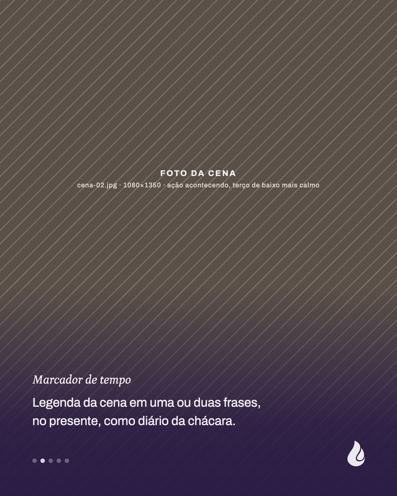
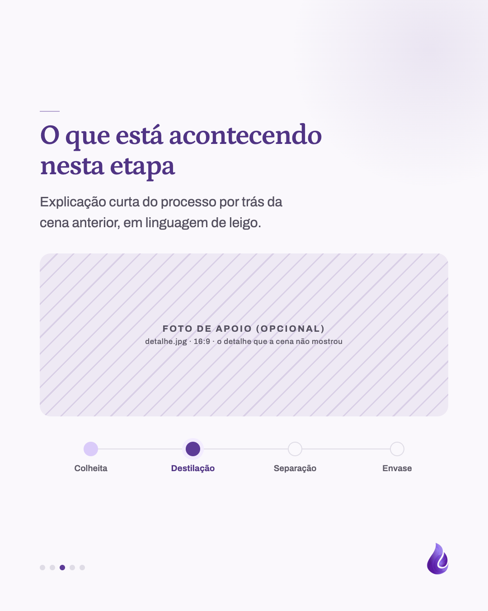
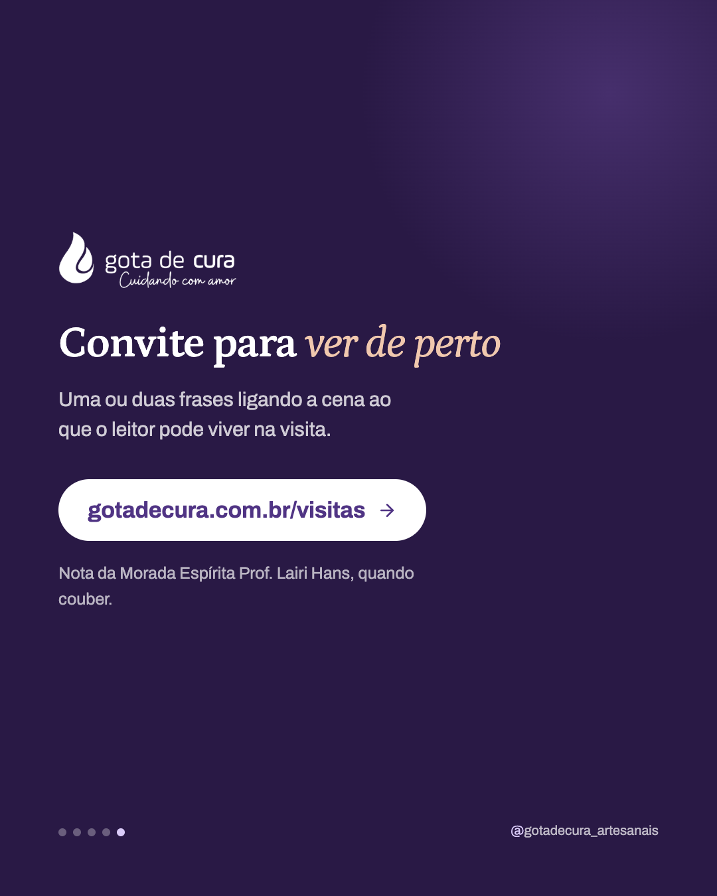

# Template `bastidores`

Carrossel narrativo da chácara que alterna **cenas** (foto em tela cheia com legenda curta)
e **explicações** (slide claro com o processo por trás da cena). Fecha com convite para a
visita guiada.

## Preview

| Capa | Cena | Explicação | Fecho |
|---|---|---|---|
|  |  |  |  |

HTML em `previews/bastidores/`.

## Quando usar

- Pilar **Bastidores da chácara**: manhã de destilação, colheita, secagem, envase, visita.
- Há **pelo menos duas fotos reais** da mesma situação.
- O post conta *o que aconteceu* ("hoje destilamos lavanda"), não *o que é* um conceito.

**Não use quando** não há foto real da chácara: sem foto, bastidores vira ilustração e
perde o sentido; prefira `carrossel-educativo`. **Não use** para apresentar a planta como
produto: é `ficha-da-planta`.

## Estrutura de slides

| Slide | Tema | Papel |
|---|---|---|
| 1 | Foto natural | Capa: logo no topo; carimbo (lugar + hora) e título narrativo na base. Sem sub. |
| 2 a N-1 | Alternados | **Cena**: foto em tela cheia, marcador de tempo em itálico e legenda de 1–2 frases. **Explicação**: claro, rule-mark, título, lead, foto de apoio opcional, linha do processo. |
| N | Escuro `#291945` | Fecho: logo, frase com itálico, botão para `gotadecura.com.br/visitas`. |

Total de 4 a 7 slides. Nunca duas explicações seguidas; duas cenas seguidas podem.

## Capa

Foto em **cor natural** (nunca duotone) e scrim só nas pontas, para a cena ficar viva no
meio. Carimbo com dois ícones Lucide (`map-pin`, `clock`) em terracota clara.

```css
.scrim { position: absolute; inset: 0;
  background: linear-gradient(180deg, rgba(41,25,69,0.50) 0%, rgba(41,25,69,0) 20%,
    rgba(41,25,69,0) 52%, rgba(41,25,69,0.88) 84%, rgba(41,25,69,0.94) 100%); }
.content { position: absolute; inset: 0; padding: 96px 88px 180px; display: flex; flex-direction: column; }
.stamp { display: flex; gap: 30px; font-size: 21px; font-weight: 600; letter-spacing: 0.08em;
  text-transform: uppercase; color: #f0c8ae; }
.stamp svg { width: 26px; height: 26px; }
h1 { font-size: 80px; line-height: 1.05; margin-top: 22px; max-width: 16ch; }
```

## Slides internos

**Cena**: sem título. Scrim só no terço de baixo; gota branca no canto.

```css
.scrim { background: linear-gradient(180deg, rgba(41,25,69,0) 0%, rgba(41,25,69,0) 58%,
  rgba(41,25,69,0.86) 86%, rgba(41,25,69,0.94) 100%); }
.caption { position: absolute; left: 88px; right: 88px; bottom: 180px; }
.time { font-family: 'Petrona', serif; font-style: italic; font-weight: 500; font-size: 46px; color: #f0c8ae; }
.caption p { font-size: 34px; line-height: 1.45; color: rgba(255,255,255,0.92); max-width: 34ch; }
.mark { filter: brightness(0) invert(1); }
```

**Explicação**: base clara padrão, com a linha do processo como componente próprio.

```css
.frame { height: 360px; border-radius: 24px; object-fit: cover; }   /* foto de apoio, opcional */
.steps { display: grid; grid-template-columns: repeat(4, 1fr); position: relative; }
.steps::before { content: ''; position: absolute; top: 15px; left: 12.5%; right: 12.5%; height: 2px; background: #dfdce6; }
.dot { width: 32px; height: 32px; border-radius: 50%; border: 2px solid #dfdce6; }
.step.done .dot { background: #dacbf9; border-color: #dacbf9; }
.step.now .dot  { background: #5d3b97; border-color: #5d3b97; box-shadow: 0 0 0 8px #f3ecff; }
```

## Fecho

Como o fecho do `carrossel-educativo` (escuro, logo, blob), mas com **botão** branco para
`/visitas` em vez de URL em texto: aqui o fecho é um convite para agir.

## Imagens

- **Exige** pelo menos 2 fotos reais da chácara: `cena-01.jpg` (capa), `cena-02.jpg`…
  mínimo 1080×1350.
- Cenas com ação acontecendo (vapor, mãos, colheita), terço de baixo mais calmo para a legenda.
- Foto de apoio da explicação (`detalhe.jpg`, 16:9) é opcional: o detalhe que a cena não mostrou.
- **Nunca foto de banco.** Bastidores é prova de que acontece de verdade.
- Fotos das visitas em `public/images/visit/` servem de ponto de partida.

## Escala tipográfica

| Elemento | Tamanho |
|---|---|
| Carimbo | 21px caixa alta, `#f0c8ae` |
| Título da capa | 72–80px, `max-width: 16ch` |
| Marcador de tempo (cena) | 44–46px Petrona itálico |
| Legenda (cena) | 32–34px, até 2 frases |
| Título (explicação) | 58–62px |
| Rótulo da etapa | 19px |

## Variações permitidas

- Carimbo: lugar + hora, lugar + data, ou só um dos dois.
- Marcador de tempo da cena: hora ("6h40"), etapa ("Primeiro vapor") ou nenhum.
- Linha do processo: 3 a 5 etapas, com nomes do processo contado (ex.: colheita →
  secagem → envase); pode ser omitida se a explicação não for sequencial.
- Foto de apoio na explicação: presente ou ausente.
- Ordem e quantidade de cenas e explicações, respeitando "nunca duas explicações seguidas".
- Fecho com ou sem nota da Morada; URL `/visitas` ou `/visitas/inscricao` quando as
  inscrições estiverem abertas.

## Travas

- **Fotos em cor natural, sempre.** Duotone é linguagem de conceito (`carrossel-educativo`,
  `destaque-faixa`); bastidores mostra a chácara como ela é.
- **Cena não tem título, só legenda na base.** A foto é o conteúdo; título grande em cima
  dela a transforma em capa.
- **Voz narrativa, no presente ou pretérito, primeira pessoa do plural** ("colhemos",
  "a caldeira acende"). Nada de imperativo nas cenas.
- **Fecho com botão para visitas.** É o único template que convida para a chácara; o
  convite é o motivo de existir do bastidores.
- Herdadas do `BRAND.md`: logo só na capa e no fecho, gota no canto dos internos (branca
  sobre foto), marcador de círculos, `background` no `body`, nada de emoji.

## Posts de referência

Nenhum ainda. O primeiro post que usar este template vira a referência.
