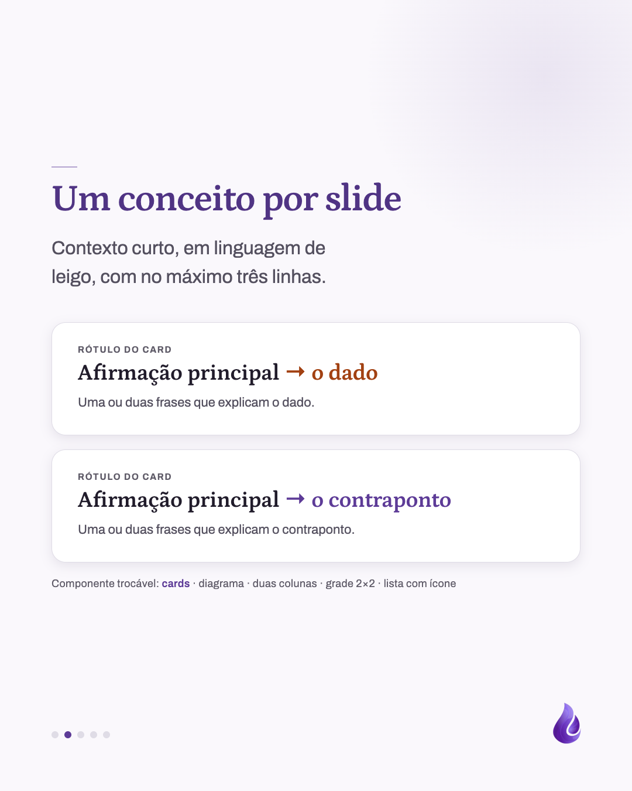

# Template `carrossel-educativo`

Carrossel que explica um conceito em partes: capa com foto que para o scroll, um conceito
por slide em fundo claro, fecho escuro com a URL em Petrona grande.

## Preview

| Capa | Interno | Fecho |
|---|---|---|
|  |  |  |

HTML em `previews/carrossel-educativo/`.

## Quando usar

- Adaptar um post do blog em carrossel (pilar **Educativo**).
- Responder uma dúvida frequente que precisa de 3 a 5 passos para ficar clara.
- Comparações (óleo essencial x hidrolato), cuidados de segurança, "como ler um rótulo".

**Não use quando** o assunto é uma planta específica do catálogo: aí é `ficha-da-planta`,
em que a planta é a capa. **Não use** para contar um dia na chácara: aí é `bastidores`, em
que a foto conduz. Se só quer divulgar o texto do blog, `chamada-blog` resolve em um slide.

## Estrutura de slides

| Slide | Tema | Papel |
|---|---|---|
| 1 | Escuro sobre foto | Capa: logo no topo, pergunta ou ideia na base. |
| 2 a N-1 | Claro | Um conceito por slide: rule-mark, título, lead opcional e **um** componente. |
| N | Escuro liso | Fecho: logo, frase com trecho em itálico, URL grande, linha de apoio. |

Total de 5 a 7 slides (3 a 5 internos).

## Capa

Foto em tela cheia, scrim vertical mais pesado na base, faixa terracota de 5px no topo.
O título fica na base, **acima** do marcador e do handle.

```css
.photo { position: absolute; inset: 0; width: 100%; height: 100%; object-fit: cover; }
.scrim { position: absolute; inset: 0;
  background: linear-gradient(180deg, rgba(41,25,69,0.55) 0%, rgba(41,25,69,0.22) 30%,
    rgba(41,25,69,0.30) 50%, rgba(41,25,69,0.90) 100%); }
.accent-top { position: absolute; top: 0; left: 0; right: 0; height: 5px; background: #cd632d; z-index: 2; }
.content { position: absolute; inset: 0; padding: 100px 88px; display: flex; flex-direction: column; }
.headline { margin-top: auto; padding-bottom: 80px; }
h1 em { font-style: italic; font-weight: 500; color: #f0c8ae; } /* trecho opcional */
```

Duotone (post-05) é a alternativa quando a foto tem cor que briga com a paleta: `.photo`
com `filter: grayscale(1)`, mais `.duo-shadow` (`#2a1a48`, `mix-blend-mode: lighten`) e
`.duo-light` (`#f1cebb`, `mix-blend-mode: darken`).

## Slides internos

Base clara com `justify-content: center` e `padding: 120px 88px 180px` (o rodapé fica livre
para marcador e gota). Um **componente** por slide, escolhido pelo conteúdo:

| Componente | Quando | Referência |
|---|---|---|
| Cards empilhados (`.card`, até 3) | Dados comparáveis, "X → Y" | post-01 slide 3 |
| Diagrama SVG + legenda | Processo físico (funil, alambique) | post-01 slide 2 |
| Duas colunas | "Quando usar cada um" | post-01 slide 4 |
| Grade 2×2 com filete no topo | Caso a caso por grupo | post-05 slide 4 |
| Lista com marcador | Cuidados, passos | post-05 slide 5 |

```css
.card { background: #ffffff; border: 1px solid #dfdce6; border-radius: 24px;
  padding: 38px 44px; box-shadow: 0 6px 20px rgba(41,25,69,0.10); }
.card .big strong { color: #a24112; }        /* dado em terracota */
.card.brand .big strong { color: #5d3b97; }  /* contraponto em lilás */
.mark { position: absolute; right: 84px; bottom: 78px; width: 52px; opacity: 0.9; }
```

## Fecho

Fundo `#291945` liso com blob lilás, logo 270px. URL como **texto** Petrona 60px `#dacbf9`,
não como botão: o carrossel já foi lido, o fecho é calmo.

```css
.url { font-family: 'Petrona', serif; font-weight: 600; font-size: 60px; color: #dacbf9; margin-top: 52px; }
.sub { font-size: 25px; line-height: 1.5; color: rgba(255,255,255,0.68); margin-top: 18px; max-width: 40ch; }
```

## Imagens

- **Exige** uma foto de capa: `cover.jpg`, mínimo 1080×1350, com área calma no terço de baixo.
- Internos não usam foto (diagrama SVG é permitido).
- `logo.png` e `mark.png` copiados de `public/images/logos/` (`logo.png` e `logo-icon.png`).

## Escala tipográfica

| Elemento | Tamanho |
|---|---|
| Título da capa | 74–88px, `max-width: 13–16ch` |
| Sub da capa | 32–34px |
| Título interno | 58–64px, `#503484` |
| Lead interno | 30–34px |
| Título do fecho | 58–62px |
| URL do fecho | 58–60px |

## Variações permitidas

- Foto da capa em cor natural **ou** duotone lilás/terracota.
- Trecho do título em itálico `#f0c8ae` na capa e/ou no fecho (ou nenhum).
- Componente de cada slide interno (tabela acima); dois internos seguidos não repetem o
  mesmo componente.
- Lead no slide interno: presente ou ausente.
- Posição do blob (canto superior direito ou inferior esquerdo), alternando entre slides.
- Quantidade de slides: 5 a 7.
- Fecho com ou sem a nota da Morada na linha de apoio.

## Travas

- **Capa sempre sobre foto, fecho sempre escuro liso.** É o que faz o carrossel ser
  reconhecível no grid do feed ao lado dos slides únicos.
- **Internos sempre claros, com rule-mark e gota no canto, sem logo e sem handle.** O logo
  em todo slide vira ruído; a gota assina sem competir.
- **Um conceito por slide.** Se precisa de dois componentes, são dois slides.
- **URL do fecho em texto, nunca botão.** Botão é assinatura dos slides únicos
  (`chamada-blog`, `destaque-faixa`).
- Herdadas do `BRAND.md`: marcador de círculos em todos os slides, `background` no `body`
  dos slides escuros, nada de emoji, no máximo 1 travessão por slide.

## Posts de referência

- `post-01`: Óleo essencial ou hidrolato: qual a diferença (capa em cor natural).
- `post-05`: Hidrolato para bebês, gestantes e idosos (capa em duotone).
