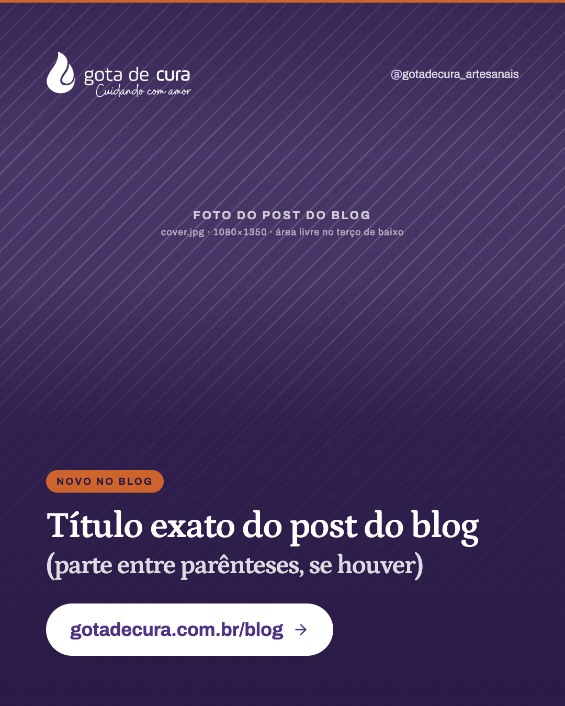

# Template `chamada-blog`

Slide único que anuncia um post novo do blog: foto em tela cheia, selo "Novo no blog",
o título exato do post e o botão com a URL.

## Preview

| Único |
|---|
|  |

HTML em `previews/chamada-blog/`.

## Quando usar

- Saiu um post novo no blog e o objetivo é levar gente para ler.
- Costuma sair em par com um `carrossel-educativo` do mesmo texto (post-01 + post-02,
  post-04 + post-05), em dias diferentes.

**Não use quando** o destino não é o blog: uma página do site (cromatografias, visitas,
catálogo) com argumento de confiança é `destaque-faixa`. Se o conteúdo precisa ser
explicado no próprio Instagram, é `carrossel-educativo`.

## Estrutura de slides

| Slide | Tema | Papel |
|---|---|---|
| 1 | Escuro sobre foto | Logo e handle no topo; selo, título e botão na base. |

## Capa

Handle **no topo à direita**, ao lado do logo, porque o botão ocupa o rodapé. Scrim com
duas zonas: leve no topo, quase sólido do meio para baixo.

```css
.scrim { position: absolute; inset: 0;
  background: linear-gradient(180deg, rgba(41,25,69,0.58) 0%, rgba(41,25,69,0.12) 22%,
    rgba(41,25,69,0.18) 40%, rgba(41,25,69,0.80) 60%, rgba(41,25,69,0.96) 100%); }
.top { display: flex; align-items: center; justify-content: space-between; }
.foot { margin-top: auto; }
.tag { display: inline-block; font-size: 19px; font-weight: 700; letter-spacing: 0.16em;
  text-transform: uppercase; color: #291945; background: #cd632d; padding: 11px 20px; border-radius: 999px; }
h1 .paren { display: block; font-size: 50px; color: rgba(255,255,255,0.84); margin-top: 10px; }
.cta { display: inline-flex; align-items: center; gap: 18px; margin-top: 46px;
  background: #ffffff; color: #503484; font-size: 36px; font-weight: 700;
  padding: 30px 46px; border-radius: 999px; box-shadow: 0 12px 38px rgba(41,25,69,0.48); }
```

Seta do botão: Lucide `arrow-right`.

## Slides internos

Não tem.

## Fecho

Não tem: o botão é o fecho.

## Imagens

- **Exige** foto: `cover.jpg`, mínimo 1080×1350. De preferência a mesma foto de capa do
  post do blog, para quem clicar reconhecer a imagem.
- O assunto da foto precisa estar no **terço de cima**; a metade de baixo fica coberta
  pelo scrim.

## Escala tipográfica

| Elemento | Tamanho |
|---|---|
| Selo | 19px, caixa alta |
| Título | 66–70px, `max-width: 18ch` |
| Segunda parte do título | 50px em `.paren` **ou** Petrona itálico no mesmo tamanho |
| Botão | 34–36px, weight 700 |
| Handle (topo) | 22px |

## Variações permitidas

- Texto do selo: "Novo no blog", "No blog", "Leitura da semana".
- Segunda parte do título: `.paren` em bloco (post-02) **ou** trecho em itálico `#f0c8ae`
  (post-04), **ou** sem segunda parte.
- Foto em cor natural ou duotone.
- Faixa terracota no topo: presente ou ausente.
- Linha de apoio curta entre título e botão (até 2 linhas, 28px), quando o título sozinho
  não diz o benefício.

## Travas

- **O título é o `title` do frontmatter do post, sem reescrever.** Quem clica precisa
  encontrar o mesmo título no site.
- **Botão em pílula branca com a URL `gotadecura.com.br/blog`.** É o único CTA; não
  acrescente "link na bio" no slide (isso vai na legenda).
- **Handle no topo, nunca no rodapé.** O botão é dono do rodapé.
- **Sem marcador de carrossel.** É post único.
- Herdadas do `BRAND.md`: `background` no `body`, logo branco por filtro, nada de emoji.

## Posts de referência

- `post-02`: Óleo essencial ou hidrolato (com `.paren`).
- `post-04`: Hidrolato para bebês, gestantes e idosos (com itálico).
