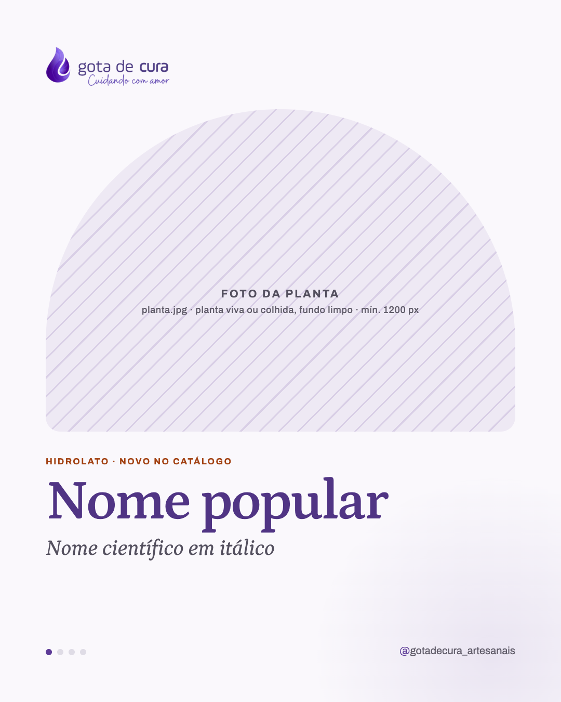
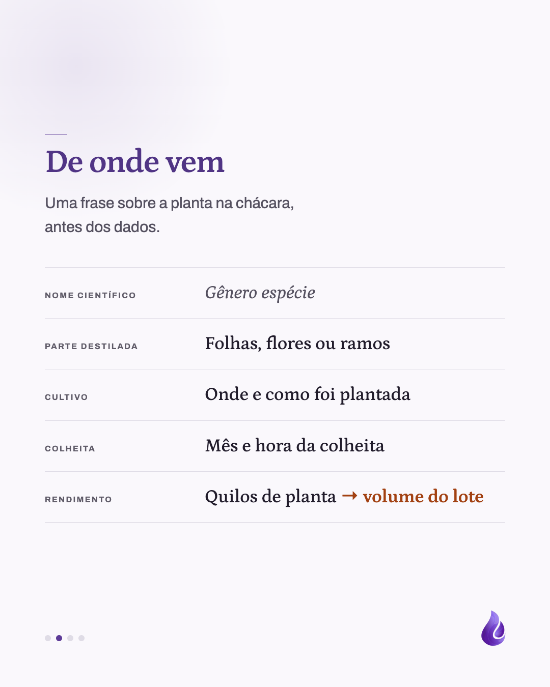
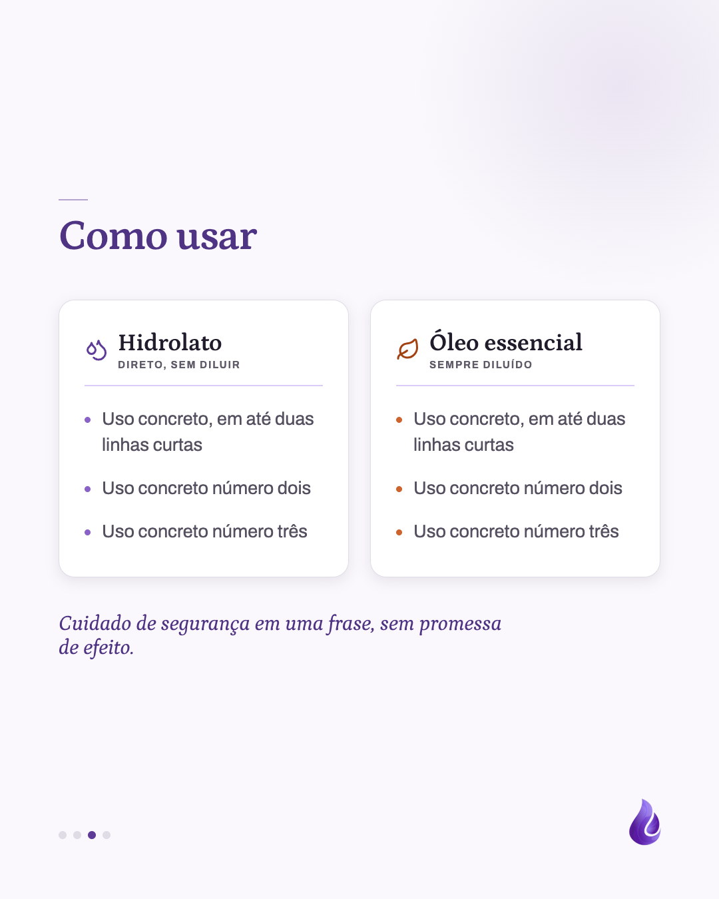
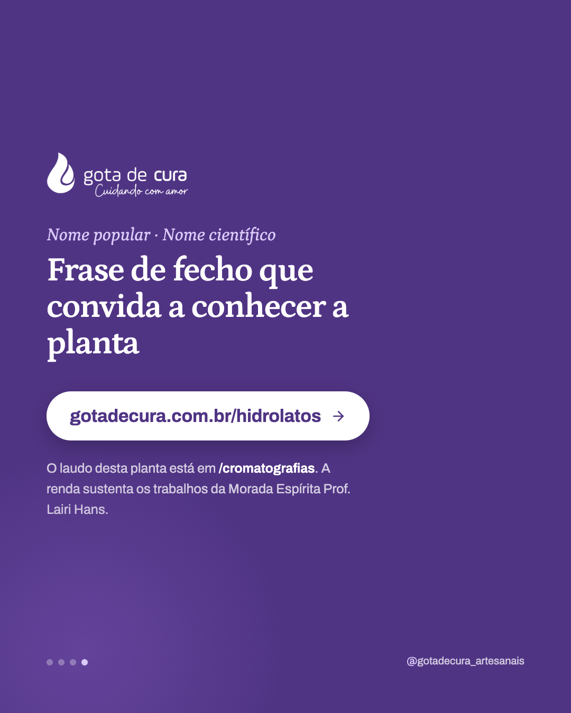
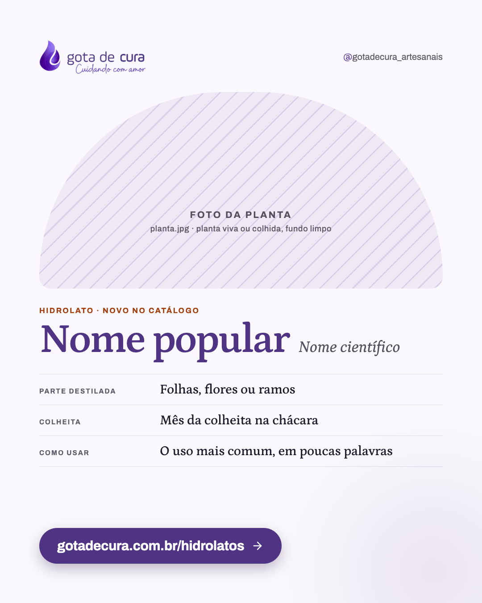

# Template `ficha-da-planta`

Monografia botânica em post: fundo claro, foto da planta num arco, nome popular enorme em
Petrona e nome científico em itálico. Existe como carrossel (4–5 slides) e como slide
único, com a mesma capa.

## Preview

| Capa | De onde vem | Como usar | Fecho | Variante única |
|---|---|---|---|---|
|  |  |  |  |  |

HTML em `previews/ficha-da-planta/`.

## Quando usar

- Pilar **Produto / lançamento**: planta nova no catálogo, lote novo da destilação.
- Apresentar uma planta que já está no catálogo ("conheça o hidrolato de…").
- **Carrossel** quando há o que contar sobre origem e uso. **Único** para anúncio rápido
  ou lembrete de estoque.

**Não use quando** o assunto é um conceito que a planta só ilustra (ex.: "por que hidrolato
estraga"): é `carrossel-educativo`. **Não use** para mostrar a destilação daquela planta
acontecendo: é `bastidores`.

## Estrutura de slides

**Carrossel**

| Slide | Tema | Papel |
|---|---|---|
| 1 | Claro | Capa: logo sem filtro, arco com foto, eyebrow terracota, nome popular, nome científico. |
| 2 | Claro | "De onde vem": ficha técnica em linhas (rótulo → valor). |
| 3 | Claro | "Como usar": duas colunas (hidrolato / óleo essencial) ou uma, se só houver um produto. |
| 4 (opcional) | Claro | "O que o laudo mostra": 2–3 componentes principais da cromatografia, em linguagem de leigo. |
| Último | Lilás `#503484` | Fecho: logo, planta em itálico, frase, botão para a página do catálogo. |

**Único**: logo + handle no topo, arco mais baixo (440px), eyebrow, nome popular com
científico na mesma linha, ficha de 3 linhas, botão lilás sólido.

## Capa

A única capa **clara** do catálogo de templates: é o que dá cara de monografia.

```css
.logo { width: 240px; height: auto; align-self: flex-start; }   /* sem filtro */
.arch { margin-top: 44px; width: 904px; height: 620px;
  border-radius: 452px 452px 28px 28px; object-fit: cover; }   /*  */
.eyebrow { margin-top: 48px; font-size: 17px; font-weight: 700; letter-spacing: 0.14em;
  text-transform: uppercase; color: #a24112; }
h1 { font-family: 'Petrona', serif; font-weight: 600; letter-spacing: -0.03em;
  font-size: 108px; line-height: 1; color: #503484; margin-top: 14px; }
.sci { font-family: 'Petrona', serif; font-style: italic; font-size: 42px; color: #54505f; margin-top: 12px; }
```

## Slides internos

Ficha técnica (slide 2) e colunas de uso (slide 3):

```css
.ficha { margin-top: 56px; border-bottom: 1px solid #dfdce6; }
.row { display: grid; grid-template-columns: 290px 1fr; align-items: baseline; gap: 24px;
  padding: 28px 0; border-top: 1px solid #dfdce6; }
.row dt { font-size: 16px; font-weight: 700; letter-spacing: 0.14em; text-transform: uppercase; color: #5f5b68; }
.row dd { font-family: 'Petrona', serif; font-weight: 500; font-size: 36px; color: #211c2b; }

.cols { display: grid; grid-template-columns: 1fr 1fr; gap: 32px; }
.col { background: #ffffff; border: 1px solid #dfdce6; border-radius: 24px; padding: 44px 38px 48px; }
.col-head { border-bottom: 2px solid #dacbf9; }  /* ícone Lucide 36px + nome em Petrona 36px */
```

Ícones das colunas: Lucide `droplets` (hidrolato, `#5d3b97`) e `leaf` (óleo essencial,
`#a24112`). Marcadores da lista na mesma cor da coluna.

## Fecho

Fundo `#503484` (não `#291945`: o fecho da planta é mais luminoso que o do carrossel
educativo). Linha com a planta em Petrona itálico `#dacbf9`, frase 64px, botão branco com
a URL da prateleira (`gotadecura.com.br/hidrolatos` ou `/oleos-essenciais`) e sub com o
laudo e a nota da Morada.

No **único**, o botão fica em slide claro: pílula **lilás sólida** `#503484` com texto
branco, sombra `0 12px 30px rgba(41,25,69,0.28)`.

## Imagens

- **Exige** foto da planta: `planta.jpg`, mínimo 1200px no lado menor.
- Planta viva no canteiro ou recém-colhida, **fundo limpo** (céu, terra lisa, mesa). Folhagem
  confusa atrás some dentro do arco.
- O topo do arco corta os cantos: centralize o assunto e deixe ar em cima.
- Sempre em cor natural (é a única cor forte num slide claro).

## Escala tipográfica

| Elemento | Carrossel | Único |
|---|---|---|
| Nome popular | 96–108px | 84–92px |
| Nome científico | 40–42px | 34–36px |
| Eyebrow | 17px terracota | 17px terracota |
| Valor da ficha | 34–36px | 28–30px |
| Título interno | 64px | não tem |

Nome popular longo (ex.: "Capim-limão") desce para 92px no carrossel e 76px no único; nunca
quebra em duas linhas.

## Variações permitidas

- Eyebrow: "Hidrolato · Novo no catálogo", "Óleo essencial · Lote de <mês>", "Na prateleira".
- Linhas da ficha: 3 a 6, escolhidas entre nome científico, parte destilada, cultivo,
  colheita, destilação, rendimento, aroma.
- Slide "Como usar" com uma coluna (só hidrolato ou só óleo) ou duas.
- Slide do laudo: presente ou ausente.
- Blob em cantos diferentes a cada slide.
- Arco com foto recortada (`object-fit: cover`) ou planta em PNG sem fundo sobre `#f1eef6`.

## Travas

- **Capa clara com o arco.** É o que separa a ficha no feed de todas as capas escuras sobre
  foto; sem isso vira mais um carrossel.
- **Nome popular maior que qualquer outro texto do post, científico sempre em itálico logo
  abaixo ou ao lado.** A planta é a protagonista (`BRAND.md`).
- **Nenhuma promessa terapêutica** em "Como usar": só formas de uso (tônico, compressa,
  borrifador), nunca "serve para tratar".
- **Hidrolato e óleo essencial com o mesmo peso visual** quando os dois aparecem: colunas
  do mesmo tamanho, nenhuma descrita como sobra.
- Herdadas do `BRAND.md`: internos com rule-mark e gota no canto, marcador de círculos no
  carrossel, logo só na capa e no fecho, nada de emoji.

## Posts de referência

Nenhum ainda. O primeiro post que usar este template vira a referência.
