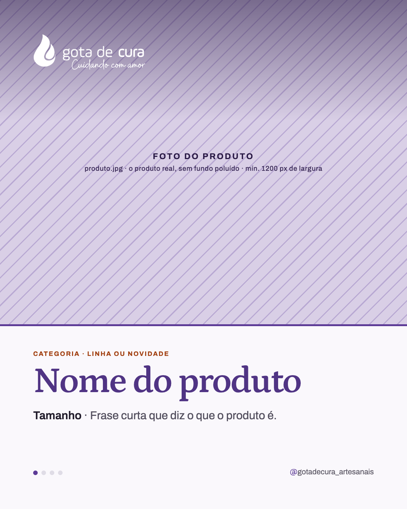
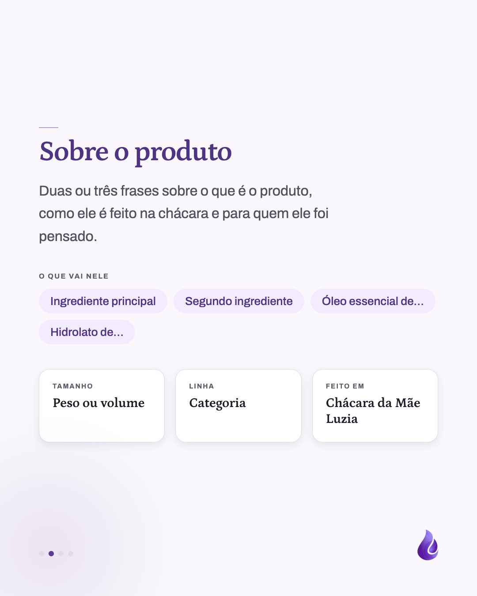
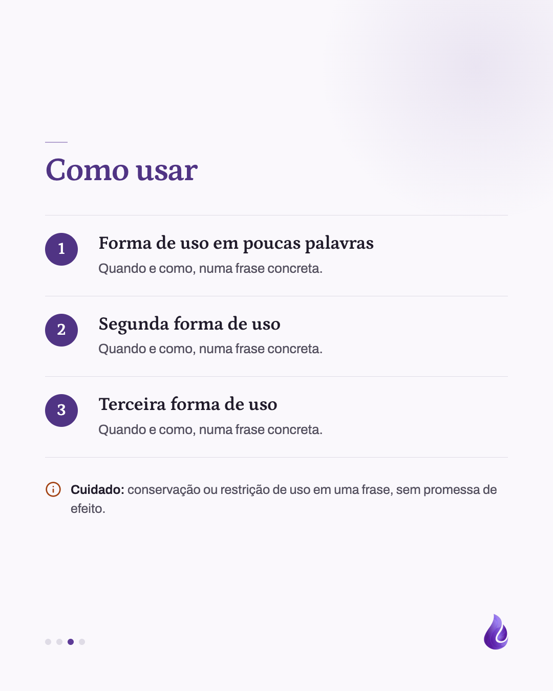
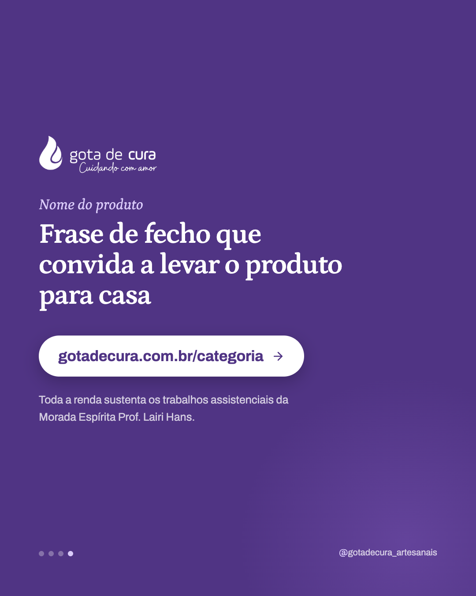
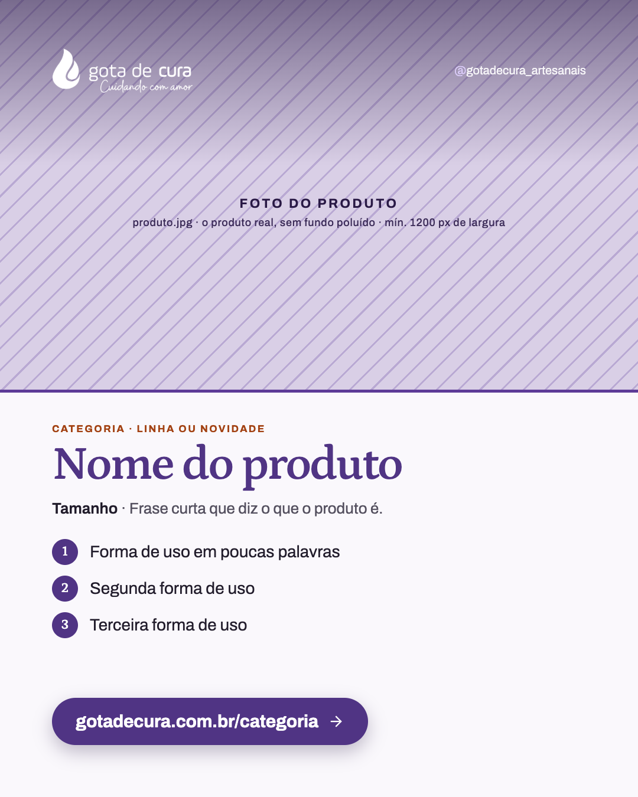

# Template `ficha-do-produto`

Vitrine de um produto pronto: a foto do produto sangrada no topo da capa, um painel claro
com o nome, e depois o que ele é e como usar. Existe como carrossel (4–5 slides) e como
slide único, com a mesma capa.

## Preview

| Capa | Sobre o produto | Como usar | Fecho | Variante única |
|---|---|---|---|---|
|  |  |  |  |  |

HTML em `previews/ficha-do-produto/`.

## Quando usar

- Pilar **Produto / lançamento**, para produtos que **não são uma planta só**: sabonetes,
  pomadas, sprays, sais de banho, colônias, tinturas, kits e a linha Gotinha de Cura.
- Apresentar um produto que já está no catálogo ("conheça o…") ou destacar um item numa
  data (Dia das Crianças, fim de ano).
- **Carrossel** quando há composição e formas de uso para contar. **Único** para anúncio
  rápido, lembrete de estoque ou data comemorativa.

**Não use quando** o protagonista é uma planta (hidrolato ou óleo essencial de uma espécie,
com nome científico): é `ficha-da-planta`. **Não use** para explicar um conceito que o
produto só ilustra (ex.: "o que é uma tintura"): é `carrossel-educativo`.

## Estrutura de slides

**Carrossel**

| Slide | Tema | Papel |
|---|---|---|
| 1 | Claro | Capa: foto do produto sangrada (860px) com logo branco sobre scrim no topo; painel claro com borda lilás, eyebrow terracota, nome do produto, tamanho + frase do que ele é. |
| 2 | Claro | "Sobre o produto": parágrafo curto, chips de "O que vai nele" e três cards de fatos (tamanho, linha, onde é feito). |
| 3 | Claro | "Como usar": lista numerada de 2 a 4 usos (título + frase) e uma linha de cuidado com o ícone `info`. |
| 4 (opcional) | Claro | "Cuidados": conservação, validade e restrições, quando não cabem na linha do slide 3. Mesma lista do slide 3, com ícones no lugar dos números. |
| Último | Lilás `#503484` | Fecho: logo, nome do produto em itálico, frase, botão para a categoria do produto no site. |

**Único**: foto sangrada mais baixa (660px) com logo e handle sobre o scrim, painel claro
com eyebrow, nome, tamanho + frase, três usos numerados em uma linha cada, botão lilás sólido.

## Capa

A foto ocupa a largura toda, sem moldura nem arco: é o que separa esta ficha da
`ficha-da-planta`.

```css
.photo { position: absolute; top: 0; left: 0; width: 1080px; height: 860px; object-fit: cover; }  /*  */
.scrim { position: absolute; top: 0; left: 0; right: 0; height: 320px;
  background: linear-gradient(180deg, rgba(41,25,69,0.55) 0%, rgba(41,25,69,0) 100%); }
.logo { position: absolute; top: 88px; left: 88px; width: 300px; filter: brightness(0) invert(1); }
.panel { position: absolute; top: 860px; left: 0; right: 0; bottom: 0; padding: 64px 88px 0;
  border-top: 5px solid #5d3b97; }
.eyebrow { font-size: 17px; font-weight: 700; letter-spacing: 0.14em; text-transform: uppercase; color: #a24112; }
h1 { font-family: 'Petrona', serif; font-weight: 600; letter-spacing: -0.03em;
  font-size: 96px; line-height: 1; color: #503484; margin-top: 16px; }
.sub { font-size: 30px; line-height: 1.5; color: #54505f; margin-top: 20px; }  /* <b>90 g</b> · frase */
```

## Slides internos

"Sobre o produto" (chips e cards de fatos) e "Como usar" (lista numerada):

```css
.chips span { background: #f3ecff; color: #503484; font-size: 26px; font-weight: 500;
  padding: 14px 26px; border-radius: 999px; }
.facts { display: grid; grid-template-columns: repeat(3, 1fr); gap: 24px; }
.fact { background: #ffffff; border: 1px solid #dfdce6; border-radius: 24px; padding: 30px 30px 34px; }
.fact dd { font-family: 'Petrona', serif; font-weight: 600; font-size: 30px; }

.uses li { display: grid; grid-template-columns: 76px 1fr; gap: 28px;
  padding: 34px 0; border-top: 1px solid #dfdce6; }
.num { width: 64px; height: 64px; border-radius: 50%; background: #503484; color: #ffffff;
  font-family: 'Petrona', serif; font-weight: 600; font-size: 32px; }
.uses h2 { font-family: 'Petrona', serif; font-weight: 600; font-size: 36px; }
.uses p { font-size: 26px; color: #54505f; }
.care svg { color: #a24112; }  /* Lucide info, 32px */
```

## Fecho

Mesmo fecho lilás `#503484` da `ficha-da-planta`, com o nome do produto (não da planta) em
Petrona itálico `#dacbf9`, frase 64px e botão branco com a URL da **categoria** do produto
(o `id` da categoria em `src/lib/product-types.ts`, ex.: `gotadecura.com.br/sabonetes`,
`/gotinha`). A linha de apoio leva a
nota da Morada.

No **único**, o botão fica no painel claro: pílula **lilás sólida** `#503484` com texto
branco, sombra `0 12px 30px rgba(41,25,69,0.28)`.

## Imagens

- **Exige** foto do produto real: `produto.jpg`, mínimo 1200px de largura.
- Produto inteiro e nítido, **fundo calmo** (mesa de madeira, tecido liso, canteiro
  desfocado). As fotos de `divulgacao/produtos-recortados/` servem sobre `#f1eef6`.
- O terço de cima recebe o scrim e o logo: nada importante do produto ali. Centralize o
  produto um pouco abaixo do meio da área da foto.
- Sempre em cor natural, sem duotone: quem compra precisa ver o produto como ele é.

## Escala tipográfica

| Elemento | Carrossel | Único |
|---|---|---|
| Nome do produto | 88–96px | 72–80px |
| Tamanho + frase | 30px | 26px |
| Eyebrow | 17px terracota | 17px terracota |
| Título interno | 64px | não tem |
| Título do uso | 36px | 28px (linha única) |

Nome longo (ex.: "Sabonete de argila verde") desce para 76px no carrossel e 64px no único e
pode quebrar em **no máximo duas linhas**; nesse caso, a foto da capa sobe para 800px.

## Variações permitidas

- Eyebrow: "Sabonetes · Novo no catálogo", "Gotinha de Cura · Para os pequenos",
  "Presente · Dia das Crianças", "De volta ao estoque".
- Slide "Sobre": chips de ingredientes presentes ou ausentes (produto de um ingrediente só);
  cards de fatos de 2 a 3, escolhidos entre tamanho, linha, onde é feito, validade, aroma.
- Usos: 2 a 4 no carrossel, sempre 3 no único.
- Slide "Cuidados": presente ou ausente.
- Foto recortada (`object-fit: cover`) ou produto em PNG sem fundo sobre `#f1eef6`.
- Blob em cantos diferentes a cada slide interno.

## Travas

- **Capa com a foto sangrada no topo e o painel claro embaixo.** É a assinatura do formato
  no feed: sem arco (planta) e sem foto inteira escura (educativo).
- **O nome do produto é o maior texto do post e aparece igual ao do catálogo.** Quem vê o
  post procura pelo mesmo nome no site.
- **Nenhuma promessa terapêutica** em "Como usar": só formas de uso (no banho, na pele
  limpa, borrifar no ambiente), nunca "serve para tratar" (`BRAND.md`).
- **Foto do produto real, em cor natural.** Foto ilustrativa ou tratada faz o produto
  parecer outro na hora da compra.
- **O botão leva para a categoria do produto**, não para a home: o post vende um item, o
  caminho até ele tem que ser curto.
- Herdadas do `BRAND.md`: internos com rule-mark e gota no canto, marcador de círculos no
  carrossel, logo só na capa e no fecho, nada de emoji.

## Posts de referência

Nenhum ainda. O primeiro post que usar este template vira a referência.
