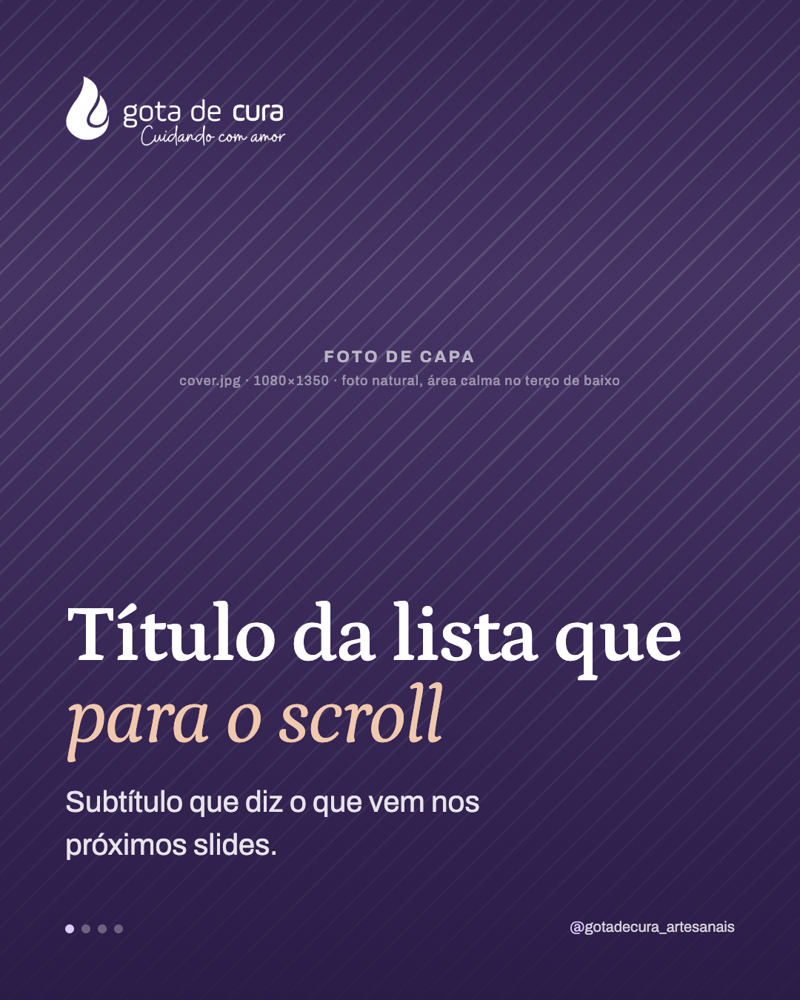
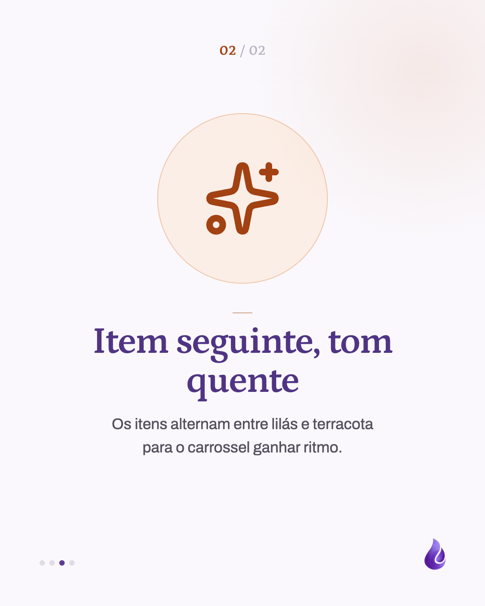

# Template `lista-ilustrada`

Uma lista contada um item por slide: capa com foto, título e subtítulo; depois, todos os
itens no **mesmo molde** (ícone grande num disco, título e descrição); fecho escuro com a
URL. A repetição é o ponto: quem passa o carrossel sabe onde olhar em cada slide.

## Preview

| Capa | Item (lilás) | Item (terracota) | Fecho |
|---|---|---|---|
|  |  |  |  |

HTML em `previews/lista-ilustrada/`.

## Quando usar

- Uma lista de 3 a 5 itens **do mesmo tipo**, que cabem cada um em título + 2 ou 3 linhas:
  valores, cuidados, motivos, passos curtos, o que tem num kit.
- Pilares **Institucional** e **Educativo**, quando o conteúdo é enumeração e não explicação.

**Não use quando** cada parte precisa de um componente próprio (dado em card, comparação em
colunas, diagrama): é `carrossel-educativo`, em que cada slide escolhe seu componente. **Não
use** para um item só com muita informação: aí é `ficha-do-produto` ou `ficha-da-planta`.

## Estrutura de slides

| Slide | Tema | Papel |
|---|---|---|
| 1 | Escuro sobre foto | Capa: logo no topo; na base, título grande e subtítulo. |
| 2 (opcional) | Lilás claro `#f1eef6` | Abertura: uma frase só, centralizada (título 92px com trecho em itálico terracota + linha de apoio). Prepara o tema da lista. |
| 2 a N-1 | Claro | Um item por slide, tudo centralizado nos dois eixos: contador `01 / 05` no topo, disco com ícone, rule-mark, título, descrição. |
| N | Escuro liso | Fecho: logo, frase com trecho em itálico, linha de apoio, URL em texto grande, linha final. |

Total de 5 a 8 slides (3 a 5 itens, mais a abertura opcional). Com abertura e 5 itens, o post
fica com 8 slides, acima da faixa de 3 a 7 do `BRAND.md`: use só quando a frase de abertura
for indispensável.

## Capa

Mesma base da capa do `carrossel-educativo` (foto em tela cheia, scrim mais pesado na
base), sem eyebrow nem faixa terracota: só título e subtítulo, **maiores** que no
educativo, porque a capa carrega sozinha a promessa da lista.

```css
h1 { font-size: 108px; line-height: 1.02; max-width: 12ch; }
h1 em { font-style: italic; font-weight: 500; color: #f0c8ae; }
.sub { font-size: 40px; line-height: 1.45; margin-top: 30px; max-width: 26ch; }
```

## Slides internos

Disco e texto ficam **centralizados na vertical e na horizontal**. Para o disco não mudar
de lugar quando um título quebra em duas linhas, título e descrição vivem num bloco
`.text` de **altura fixa** (360px: título de até 2 linhas + descrição de até 3). O grupo
inteiro tem sempre a mesma altura, então o centro também não muda.

```css
.slide { padding: 150px 96px 170px; display: flex; flex-direction: column;
  align-items: center; justify-content: center; text-align: center; }
.text { height: 360px; display: flex; flex-direction: column; align-items: center; }
.count { position: absolute; top: 96px; left: 0; right: 0; text-align: center;
  font-family: 'Petrona', serif; font-weight: 600; font-size: 30px; color: #5d3b97; }  /* 01 <span>/ 05</span> */
.count span { color: #b8b3c2; font-weight: 500; }
.disc { width: 380px; height: 380px; border-radius: 50%; background: #f3ecff; color: #5d3b97;
  display: grid; place-items: center; box-shadow: inset 0 0 0 2px #dacbf9; }
.disc svg { width: 176px; height: 176px; }                  /* Lucide, stroke-width 2 */
.warm .disc { background: #fbeee6; color: #a24112; box-shadow: inset 0 0 0 2px #f0c8ae; }
.rule-mark { margin-top: 64px; }  /* barra centralizada: margin: 0 auto 20px */
h1 { font-size: 84px; line-height: 1.04; color: #503484; max-width: 14ch; }
.desc { font-size: 34px; line-height: 1.55; color: #54505f; margin-top: 26px; max-width: 30ch; }
```

**Variante ilustração.** No lugar do disco com ícone, o item pode levar uma ilustração
(`valor-*.png` etc.) numa caixa fixa de 600×440, com `object-fit: contain`. A arte precisa
de **fundo transparente**: se vier sobre branco, remova o fundo antes (o branco vira alfa) e
suavize a borda do recorte, senão o retângulo aparece contra o fundo do slide. Todas as
ilustrações do post no **mesmo estilo** e com o mesmo enquadramento.

```css
.art { width: 600px; height: 440px; object-fit: contain; }
.art + .rule-mark { margin-top: 44px; }
```

Os itens **alternam** o tom: ímpares em lilás, pares em `.warm` (terracota). Contador,
rule-mark e blob acompanham o tom; o título fica sempre `#503484`.

## Fecho

Igual ao do `carrossel-educativo`: fundo `#291945` liso com blob lilás, logo 270px, frase
62px com trecho opcional em itálico `#f0c8ae`, URL como **texto** Petrona 60px `#dacbf9`.

## Imagens

- **Exige** uma foto de capa: `cover.jpg`, mínimo 1080×1350, com área calma no terço de baixo.
- Os itens não usam foto: o ícone é a imagem. Um ícone por item, da Lucide (`lucide-static`),
  com o path copiado do pacote. O mesmo ícone não se repete dentro do post.
- `logo.png` e `mark.png` copiados de `public/images/logos/`.

## Escala tipográfica

| Elemento | Tamanho |
|---|---|
| Título da capa | 100–108px, `max-width: 12ch` |
| Subtítulo da capa | 38–40px |
| Contador | 30px Petrona |
| Título do item | 76–84px, no máximo 2 linhas |
| Descrição do item | 32–34px, no máximo 3 linhas |
| Título do fecho | 58–62px |
| URL do fecho | 58–60px |

## Variações permitidas

- Foto da capa em cor natural **ou** duotone lilás/terracota.
- Trecho do título em itálico na capa e/ou no fecho (ou nenhum).
- Quantidade de itens: 3 a 5.
- Visual dos itens: ícone Lucide em disco **ou** ilustração (nunca os dois no mesmo post).
- Slide de abertura com frase: presente ou ausente.
- Tom do primeiro item (lilás ou terracota); a alternância continua a partir dele.
- Linha final do fecho com ou sem a nota da Morada.

## Travas

- **Todos os itens no mesmo molde, centralizados, com o disco na mesma posição.** É o que
  define o template; se um item pede outro componente, o post é `carrossel-educativo`. O
  bloco `.text` de altura fixa é o que segura o disco: não troque por altura automática.
- **Um item por slide, com título e descrição curtos.** Descrição que passa de 3 linhas
  vira dois itens ou outro template.
- **Ícones só da Lucide, um por item, sem repetir.** Ícone desenhado à mão ou repetido
  quebra a leitura do disco como "o símbolo deste item". Na variante ilustração, vale o
  mesmo: uma arte por item, todas da mesma série.
- **Contador `NN / NN` no topo de cada item.** Diz ao leitor quanto falta, junto do
  marcador de círculos.
- Herdadas do `BRAND.md`: internos com rule-mark e gota no canto, sem logo e sem handle;
  marcador de círculos em todos os slides; `background` no `body` dos slides escuros; nada
  de emoji; URL do fecho em texto, não botão.

## Posts de referência

- `post-10`: Os valores da Gota de Cura (capa em cor natural, abertura "muitas mãos", 5 itens com ilustração).
